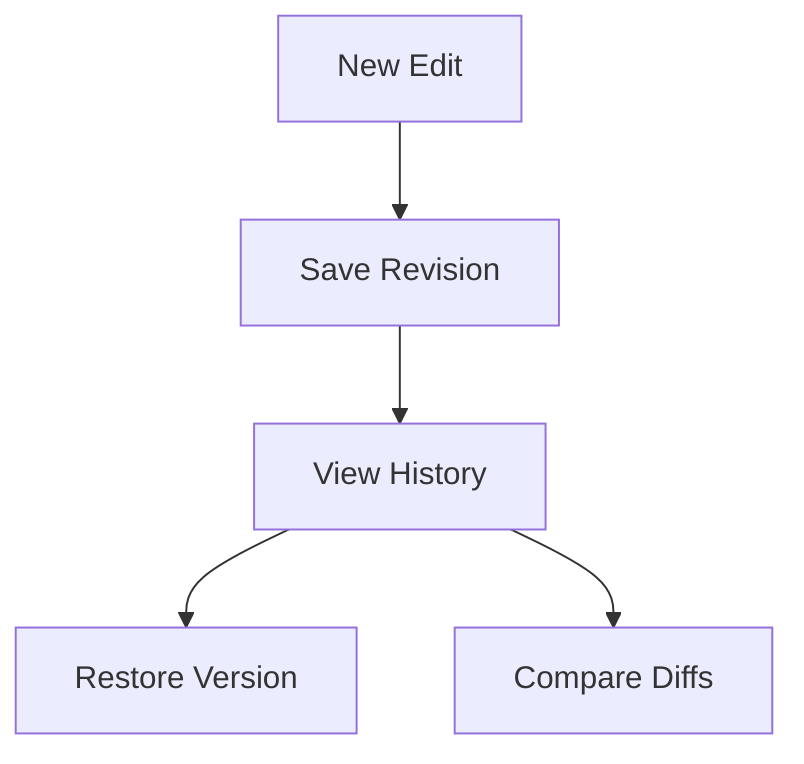

## Overview

Groupebmr provides powerful tools to manage your project documentation efficiently. You organize content into intuitive structures, collaborate with teams securely, track changes over time, and find information quickly. These core features scale from small projects to enterprise workflows.

<Columns cols={2}>
  <Card title="Document Organization" icon="folder" href="#document-organization">
    Create hierarchies with folders and pages.
  </Card>
  <Card title="Collaboration" icon="users" href="#collaboration">
    Manage permissions and real-time edits.
  </Card>
  <Card title="Version History" icon="git-branch" href="#version-history">
    Track revisions and restore previous versions.
  </Card>
  <Card title="Search and Tagging" icon="search" href="#search-tagging">
    Find content fast with advanced search.
  </Card>
</Columns>

## Document Organization and Hierarchies

You structure your documentation using nested folders and pages. Create a root workspace, add subfolders for topics like `API Reference` or `User Guides`, and nest pages within them. This mirrors your project's architecture.

<Callout kind="tip">
  Use clear naming conventions like `v1.0-api` for versions to maintain organization.
</Callout>

<Tabs>
  <Tab title="Create Folder" icon="folder-plus">
    ```javascript
    // API example to create a folder
    const response = await fetch('https://api.example.com/folders', {
      method: 'POST',
      headers: { 'Authorization': 'Bearer YOUR_TOKEN' },
      body: JSON.stringify({
        name: 'API Reference',
        parentId: 'workspace-root'
      })
    });
    ```
  </Tab>
  <Tab title="Move Page" icon="move">
    ```javascript
    // Move a page to a new folder
    await fetch('https://api.example.com/pages/move', {
      method: 'POST',
      body: JSON.stringify({
        pageId: 'page-123',
        folderId: 'api-reference-folder'
      })
    });
    ```
  </Tab>
</Tabs>

## Collaboration and Permissions

Invite team members and assign roles like `Editor`, `Viewer`, or `Admin`. You control access at workspace, folder, or page levels. Real-time collaboration lets multiple users edit simultaneously.

<Steps>
  <Step title="Invite User" icon="user-plus">
    Navigate to workspace settings and add emails.
  </Step>
  <Step title="Set Permissions" icon="shield">
    Choose role: `Editor` for full access, `Viewer` for read-only.
  </Step>
  <Step title="Review Activity" icon="activity">
    Check the audit log for changes.
  </Step>
</Steps>

## Version History and Revisions

Every edit creates a new revision. You view diffs, restore versions, or compare changes. This ensures accountability and easy recovery.



<Expandable title="Advanced Revision Workflow" default-open="false">
  Use the API to fetch history:

````javascript
const history = await fetch('https://api.example.com/pages/{pageId}/revisions');
const revisions = await history.json();
// Restore specific revision
await fetch(`https://api.example.com/pages/{pageId}/restore`, {
  method: 'POST',
  body: JSON.stringify({ revisionId: 'rev-456' })
});
````

</Expandable>

## Search Functionality and Tagging

Search across all documents with full-text matching. Add tags like `#api` or `#urgent` for quick filtering. Combine search with tags for precise results.

<CodeGroup tabs="JavaScript,Python">
```javascript
// Search with tags
const results = await fetch('https://api.example.com/search?q=authentication&tags=api,docs');
```
```python
import requests
response = requests.get(
    'https://api.example.com/search',
    params={'q': 'authentication', 'tags': 'api,docs'}
)
```
</CodeGroup>

| Feature | Description | Example |
|---------|-------------|---------|
| Full-text Search | Matches titles and content | `auth token` |
| Tag Filtering | Narrow by labels | `#internal` |
| Advanced Filters | Date, author, type | `after:2024-01-01` |

<Callout kind="success">
  Tag consistently to maximize search effectiveness.
</Callout>

## Next Steps

Explore these features hands-on:

<Columns cols={2}>
  <Card title="Quickstart" icon="rocket" href="/quickstart">
    Set up your first workspace.
  </Card>
  <Card title="API Reference" icon="code" href="/authentication">
    Integrate programmatically.
  </Card>
</Columns>